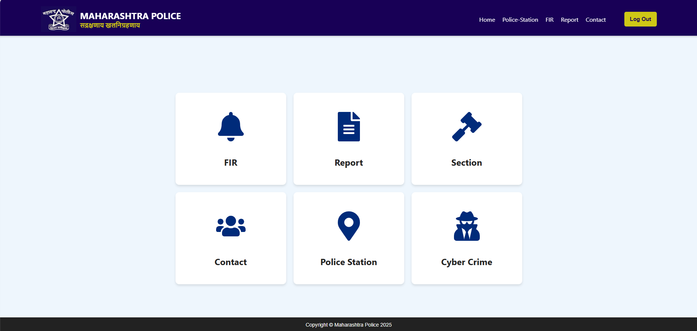
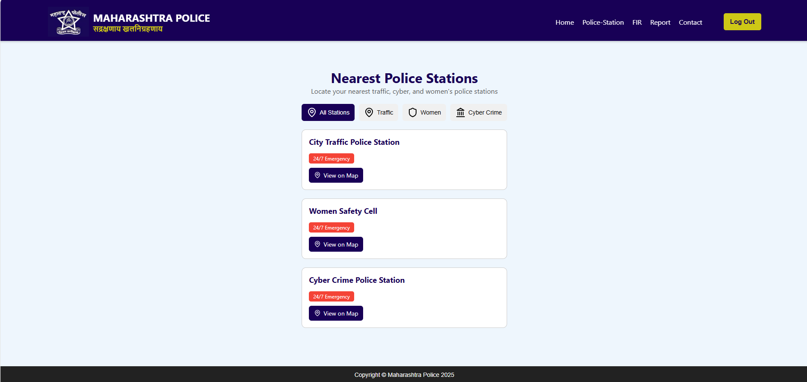

# ⚖️ FIR Drafting Assistant – Smart FIR Automation Tool ⚖️

## 📚 Project Domain
**Domain**: Law Enforcement, Artificial Intelligence (AI), Natural Language Processing (NLP), LegalTech
**Tech Stack**: MERN (MongoDB, Express.js, React.js, Node.js)

## 🧩 Problem Statement
Design a platform to assist police officers in drafting accurate FIRs using Gemini API for Natural Language Processing (NLP) and Speech-to-Text technology. The system should map incident descriptions to relevant legal sections, offer contextual legal insights, and produce FIR drafts that reduce manual workload and enhance documentation accuracy.

## 💡 Project Idea
The AI-Powered FIR Drafting Assistant is a smart legal documentation tool built for police officers to draft FIRs with greater speed and accuracy. The system uses Google’s Gemini API to analyze complaint narratives, map them to relevant IPC/CrPC sections, and auto-generate structured FIR drafts. With added features like voice input, PDF download, and legal references, the tool empowers law enforcement personnel to streamline FIR creation while minimizing human error.

## ✨ Features

### 📝 Smart FIR Form with Edit Option
- User-friendly FIR input form for typing or speaking.
- AI-generated draft is editable before final submission.
- Empowers officers to customize reports as needed.

### 🎙️ Voice-to-Text Conversion
- Integrated speech recognition for hands-free operation.
- Ideal for field use or fast dictation.
- Converts voice to text for further processing by Gemini API.

### 🧠 Gemini API-Based Legal Analysis
- Complaint descriptions are sent to Google Gemini API for - intelligent NLP analysis.
- AI extracts incident type, entities, and matches them to appropriate legal sections (IPC/CrPC).
- Ensures legal correctness and reduces officer burden.

### ⚙️ Automated Draft FIR Generation
- Drafts include structured sections like complainant details, incident narrative, and legal provisions.
- Provides a consistent format across all reports.
- Helps even junior officers prepare legally sound FIRs.

### 📄 FIR Report Download
- Finalized FIR can be exported as a PDF document.
- Supports sharing, printing, and legal archiving.

### 📚 Legal Reference Section
- In-built searchable database of IPC, CrPC, and related acts.
- Officers can review legal provisions and understand their application.

### 📞 Emergency Contact Directory
- Includes quick-access numbers for cybercrime, women safety, ambulance, etc.
- Facilitates coordination during emergencies.

### 📍 Nearest Police Station Locator
- Uses GPS and Maps API to detect and show nearby police stations.
- Helps in directing victims or forwarding cases to the right jurisdiction.

## 📁 Folder Overview

```
CrickApp/
├── backend/         # Node.js + Express backend
├── frontend/        # React.js frontend
├── images/          # Screenshots and UI assets
└── README.md        # Project documentation
```

## 🛠️ Getting Started

Follow the steps below to run the project locally:

### 🧬 Clone the Repository
```bash
git clone https://github.com/Ashutoshbirje/FIR_Project.git
cd FIR_Project
```

### ⚙️ Run Backend
```bash
cd Backend
npm install
set NODE_OPTIONS=--openssl-legacy-provider
npm start
```

### 💻 Run Frontend
```bash
cd ../Frontend
npm install
set NODE_OPTIONS=--openssl-legacy-provider
npm start
```

> ⚠️ On Unix-based systems (Linux/macOS), use:
```bash
export NODE_OPTIONS=--openssl-legacy-provider
```

## 🔁 Project Workflow
- User types or speaks the complaint narrative.
- Speech is converted to text using voice recognition.
- Text is sent to Gemini API for incident analysis.
- Relevant legal sections are suggested and a draft FIR is generated.
- Officer can review, edit, and finalize the FIR.
- Download FIR as a professionally formatted PDF.

## 🖼️ Screenshot Preview

LOGIN

SIGNUP

HOME

FEATURES

FIR

REPORTS

SECTIONS

POLICE STATION

ABOUT


## 🔮 Future Enhancements
- Gemini Pro Vision: Visual evidence (images, videos) processing
- Multilingual support (Hindi, Marathi, etc.)
- FIR e-submission integration with government systems
- Offline mode with local caching
- Secure officer authentication & case tracking

## 📑 Project Documentation
📑 [Documentation](https://drive.google.com/drive/folders/1vzqk-RL5Qs9ZwlOhkcgEhs9CS_BlB1eX?usp=sharing) 

## 👨‍💻 Author

**Ashutosh Birje**  
📧 [Email](ashutoshbirje880@gmail.com) 
🔗 [LinkedIn](https://www.linkedin.com/in/ashutosh-birje-246453263/)  
🌐 [Portfolio](https://ashutoshbirje.netlify.app/)
